<div align="center">

# 🏠 Roomio

### Design a room in your browser — author it, furnish it, light it, then *walk through it*.

Sketch a room in a clean wizard, furnish it from a **100-piece parametric catalog** that
**won't clip through walls**, lay out a whole house, tune the **lighting & time of day**, then
**walk it in first person** or **direct a cinematic camera flythrough and export an MP4** —
all client-side, all real-time Three.js.


<br/>

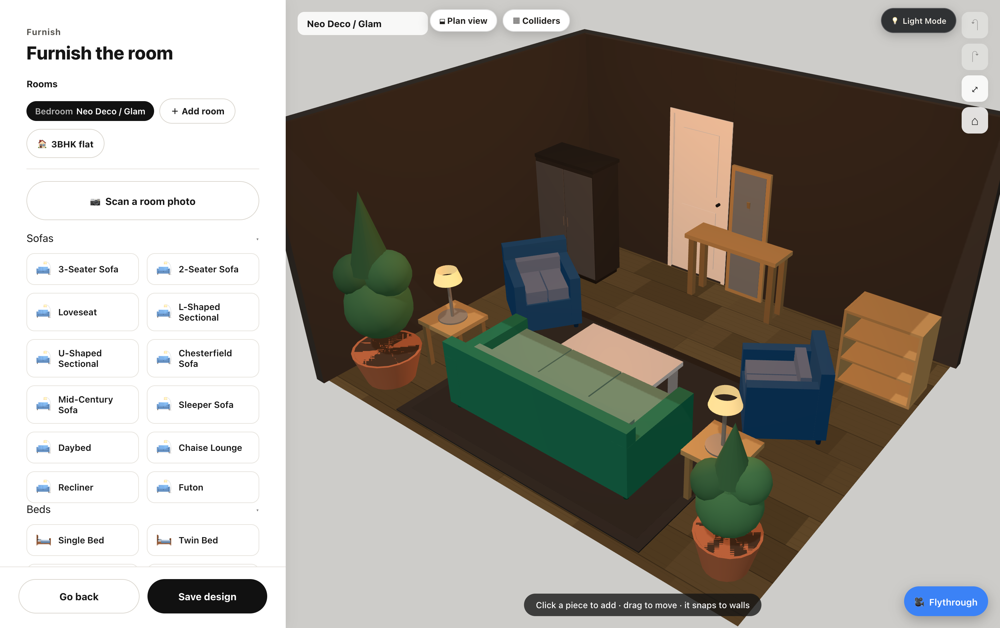

</div>

---

## ✨ What you can do

### 🛋️ Furnish from a 100-piece catalog — with real collision

Drag in furniture from a parametric catalog spanning sofas, beds, tables, chairs, storage,
décor, kitchen & bath fixtures. Every piece is **resizable, recolorable, and lockable** — and a
bespoke 2D-footprint solver means furniture **clamps and *slides* along walls, snaps flush, and
never clips through them**. No physics engine.

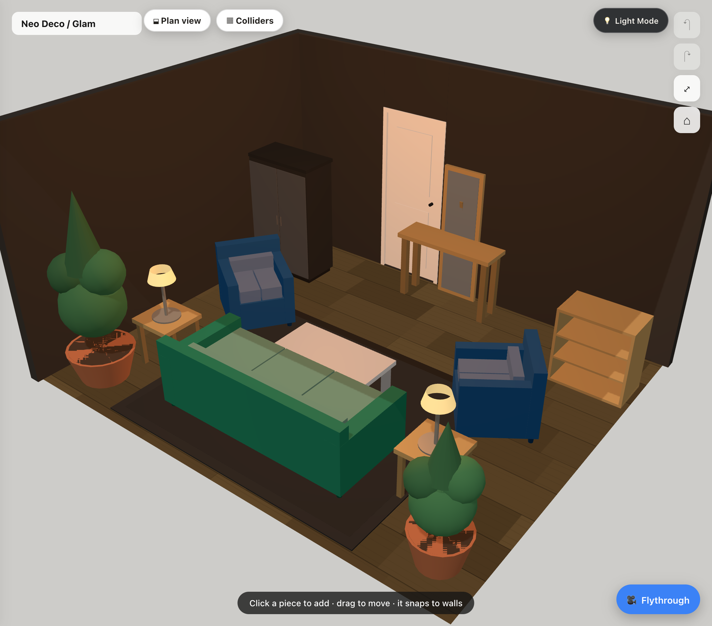

### 🎭 Start from a persona room — 10 research-grounded styles

Don't start from a blank box. Load a pre-furnished **persona** — Bachelor, Family, Gamer,
Neo-Deco / Glam, Biophilic, Celestial-Calm, Afrohemian, and more — then make it yours.

| Biophilic | Gamer Setup |
| :---: | :---: |
| 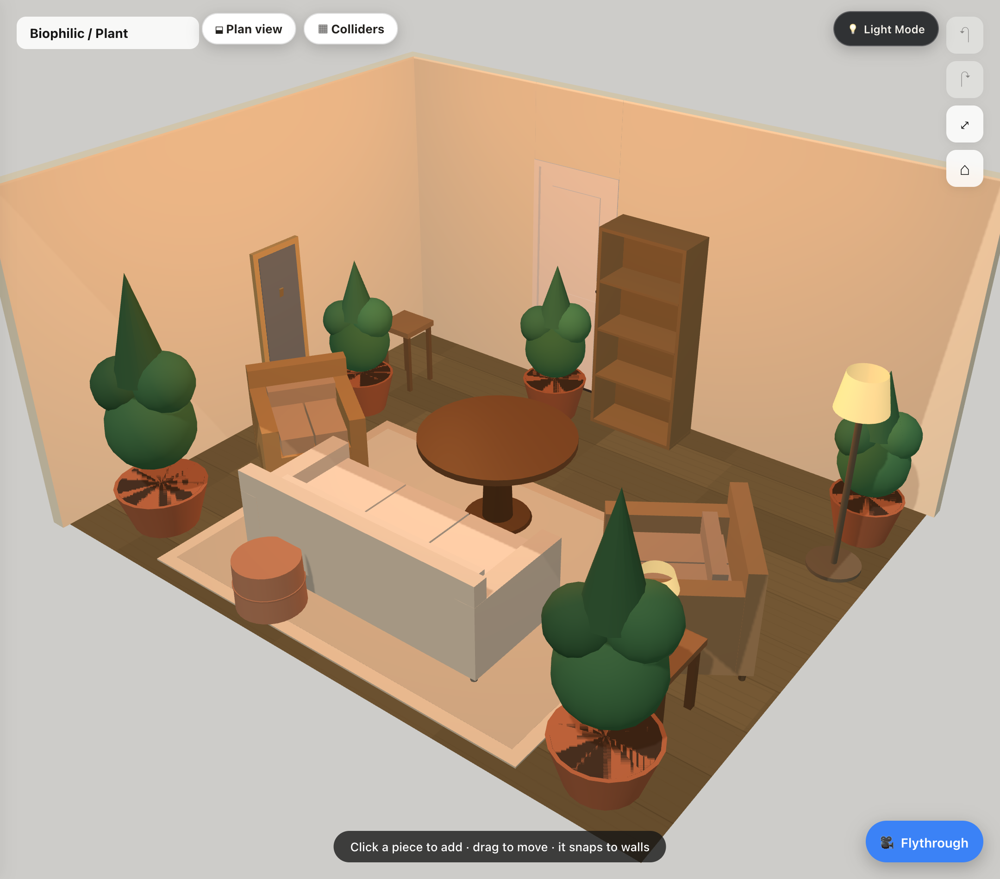 | 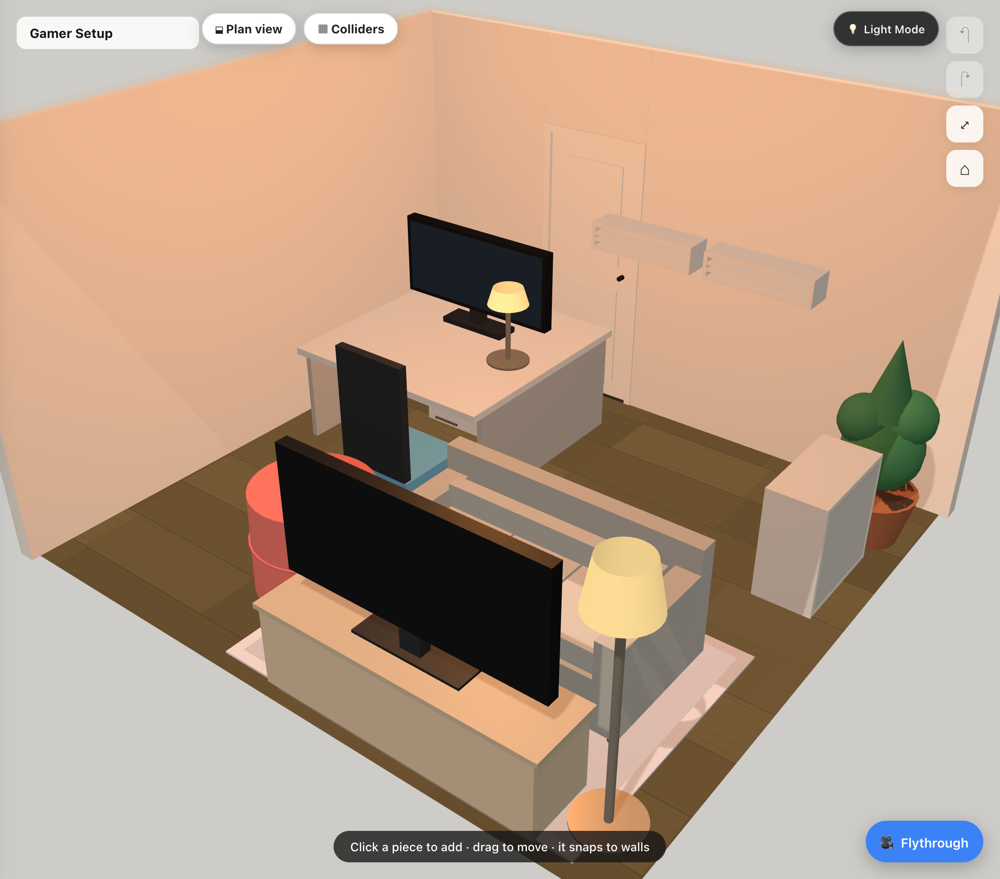 |

### 🍳 Every room type has its own vibe

Pick a room's function and it furnishes itself accordingly — **kitchens** get a counter, island,
range & refrigerator; **bathrooms** get a toilet, vanity, walk-in shower & tub.

| Kitchen | Bathroom |
| :---: | :---: |
| 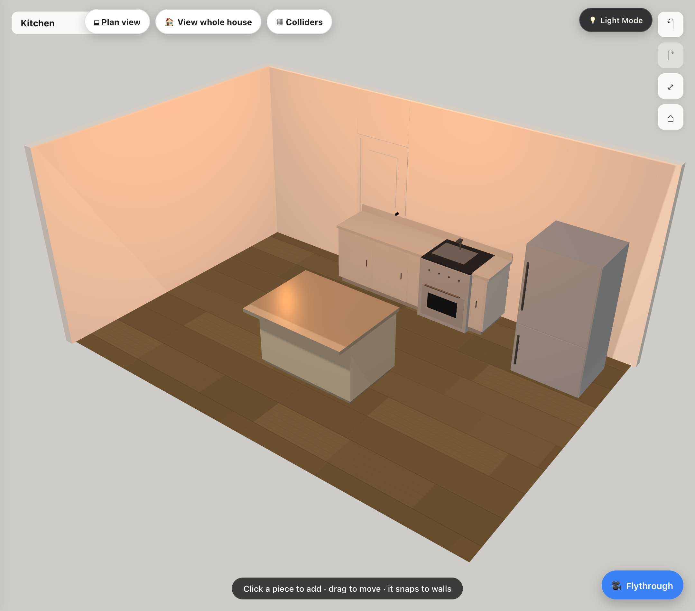 | 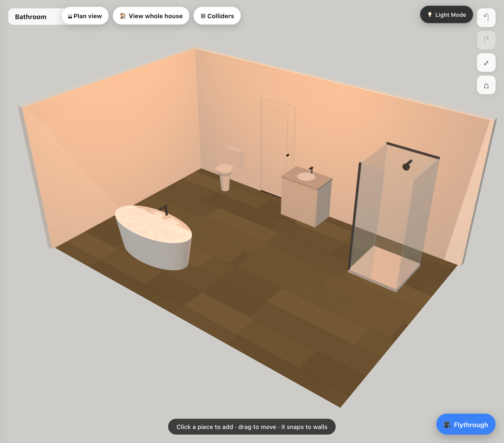 |

### 🏘️ Lay out a whole house

Add rooms one at a time — or drop in a standard **3BHK flat** — and Roomio stitches them into a
connected floor plan, **cutting doorways through shared walls automatically**.

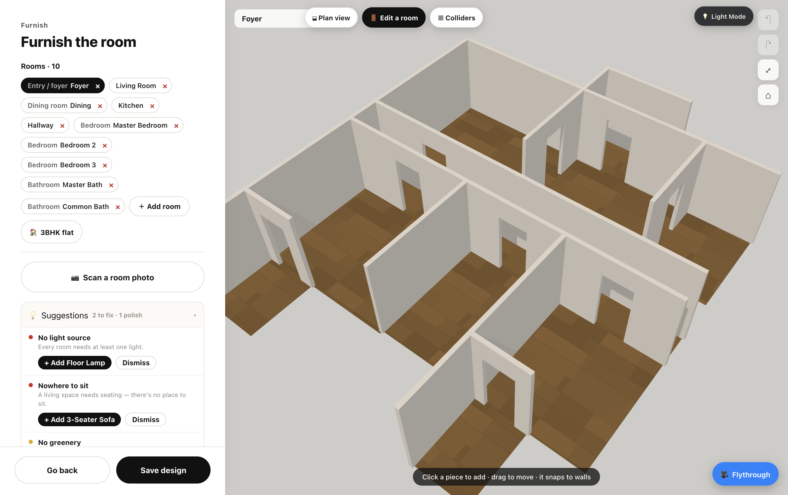

### 💡 Light it, and set the time of day

**Light Mode** turns the room into a presentation: drag the **time-of-day** slider, spin the
**sun & compass**, dial in per-room **warmth**, and add accent lights. (Furniture locks while you
focus on the light.)

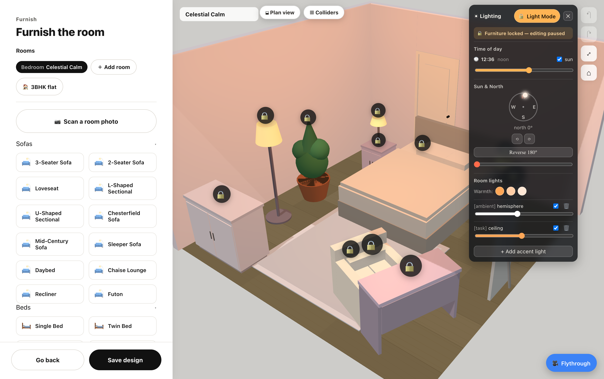

### 🚶 Walk it in first person

Drop into the room at eye height and explore — **WASD + mouse-look**, colliding with walls and
furniture just like the real thing.

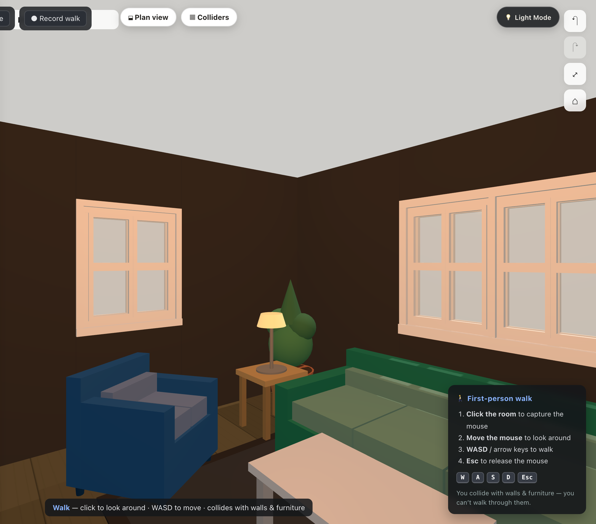

### 🎬 Direct a camera flythrough → export an MP4

A top-down **director** view: click to drop waypoints, and a smooth **Catmull-Rom spline**
threads them. Preview the glide in first-person POV, then export a **deterministic, frame-by-frame
MP4** (hardware-accelerated WebCodecs — no dropped frames).

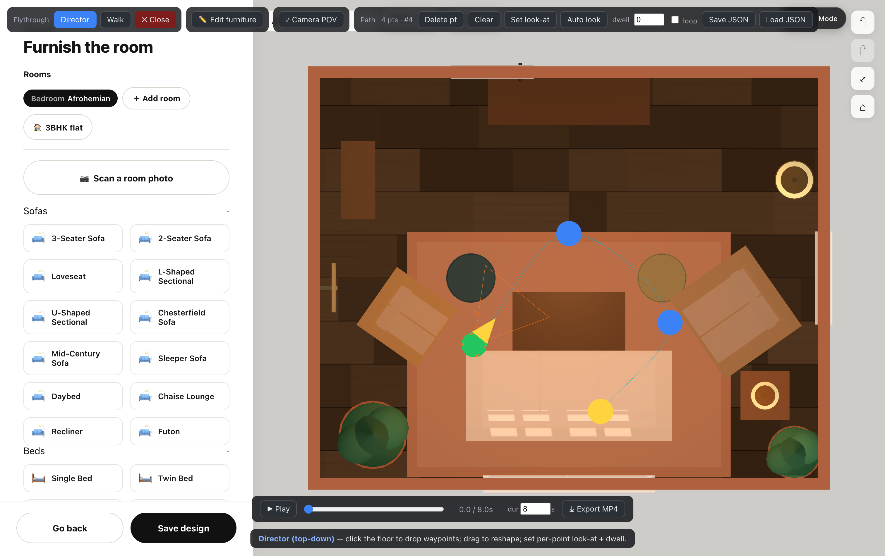

### 📷 Scan a photo → furniture suggestions

Upload a room photo (or try a sample) and a local **vision-model** pipeline proposes furniture
from the catalog — suggestion-only, nothing is auto-placed.

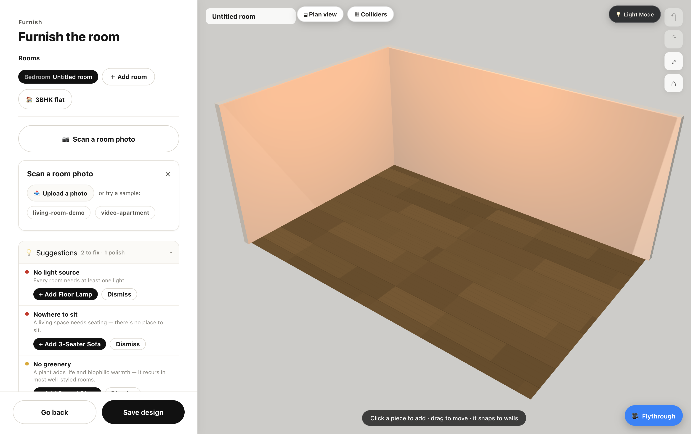

---

## 🧭 Authoring flow — a 4-step wizard

Structure first, with a live 3D preview the whole way:

| 1 · Shape | 2 · Dimensions | 3 · Doors & windows | 4 · Style |
| :---: | :---: | :---: | :---: |
|  |  |  |  |

Pick a shape (Rect / L / T / U / Cut / Beveled) → drag or type wall lengths (ft ⇄ cm) → place
doors & windows that cut **real openings** and resize → choose a wall colour and floor texture.

---

## 🚀 Features

- **4-step authoring wizard** with a persistent live 3D preview, **6 room shapes** (incl. concave
  L/T/U), draggable/typed wall dimensions (ft ⇄ cm), and **doors & windows** that cut real openings.
- **100+ parametric furniture archetypes** across sofas, beds, tables, chairs, storage, décor, and
  **kitchen / bathroom fixtures** — all in-house primitives (zero external 3D assets). Move,
  rotate, **clamped resize**, recolor, **lock in place**.
- **Bespoke collision & snapping**: a 2D footprint constraint — furniture slides along walls
  instead of stopping dead, snaps flush, and flags soft overlaps.
- **10 persona presets** + a live **suggestion engine** (no light? nowhere to sit? no focal point?).
- **Multi-room "whole house"**: add rooms, drag them on a plan, or load a standard **3BHK flat**;
  shared walls become doorways automatically.
- **Lighting & time-of-day** (Light Mode): sun direction, hour-of-day, per-room warmth, accent
  lights, soft shadows.
- **First-person walk** (PointerLockControls + WASD) with wall/furniture collision at eye height.
- **Camera flythrough**: top-down director → Catmull-Rom waypoint path → smooth playback → a
  **frame-by-frame MP4 export** via WebCodecs.
- **Scan-a-photo capture-suggestor**: a local VLM proposes furniture from a room photo.
- **Material editor** (12 wall colours + 18 procedural floor textures), **undo / redo** (⌘Z / ⌘⇧Z),
  and **accounts** — httpOnly **Postgres sessions** with per-user saved designs (guest fallback to
  `localStorage`). Save & reopen the full scene graph, including the exact camera viewpoint.

## 🏗️ Architecture

A serializable **scene graph** is the contract between every layer:

| Layer | Role |
| --- | --- |
| Room builder (wizard) | Deterministic structure: shape, dimensions, openings, materials. |
| Furnish & edit | Place / move / rotate / resize / recolor with collision + snapping. |
| Multi-room & lighting | A house of rooms, connectors cut between them, plus the lighting rig. |
| Flythrough (camera) | First-person walk + director waypoint path + deterministic MP4 capture. |
| Capture suggestor (optional) | A scan/photo that *pre-fills* suggestions — pure convenience. |

Everything the user edits is a cheap data op on addressable nodes
(`walls / floor / openings / furniture`), so a design serializes straight to JSON for save/load,
sharing, and replaying a camera path.

## 🛠️ Getting started

```bash
# Front-end — Vite dev server on http://localhost:5180
npm install
npm run dev

# Optional: auth / saved-designs backend (Express + Postgres on :5181, needs a local `roomio` db)
cd server && npm install && npm start
```

The front-end proxies `/api` → `:5181`. With the backend down, the app still runs fully as a guest.
The camera flythrough's MP4 export uses **WebCodecs**, which requires a secure context — `localhost`
qualifies.

## 🧪 Testing

```bash
npm test               # 200+ vitest unit tests (collision, geometry, lighting, multi-room, personas, persistence)
npm run check:browser  # puppeteer: console-error sweep + drag-with-collision + undo/redo
npm run check:auth     # puppeteer: signup → save → logout → login → reopen from Postgres
```

## 🧩 Tech stack

React 18 · React Three Fiber / Three.js · TypeScript · Zustand · Vite · canvas-record (WebCodecs) ·
Express · node-postgres · vitest · puppeteer-core.
