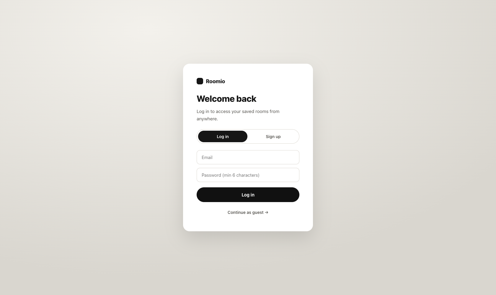
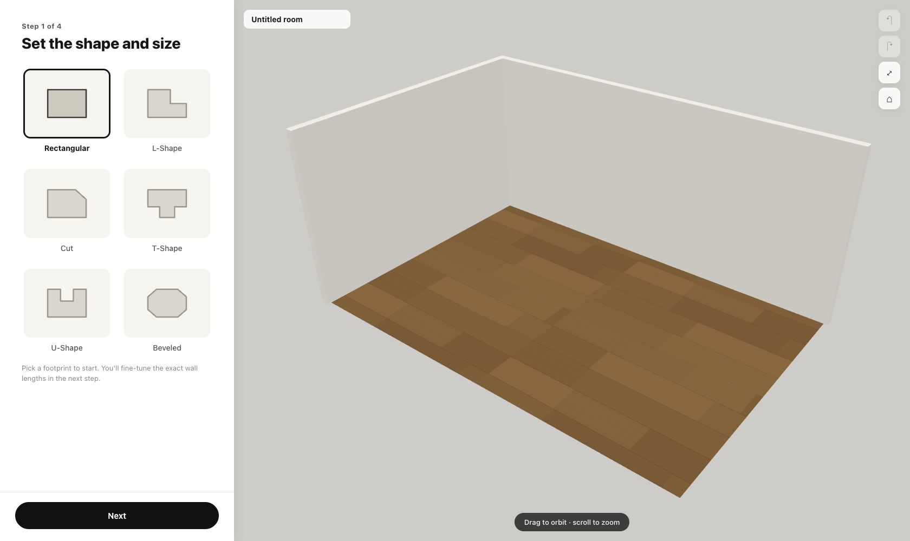
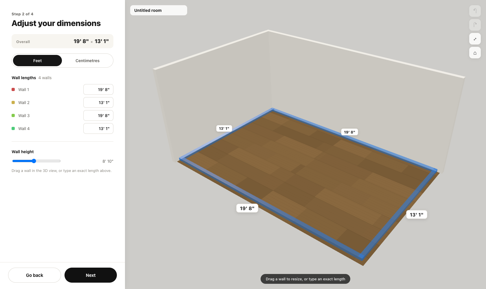
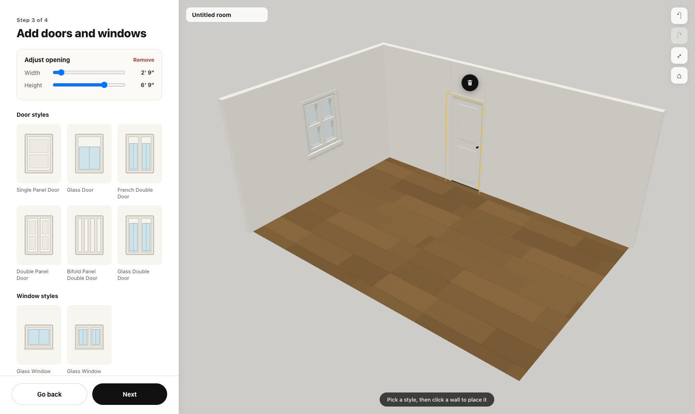
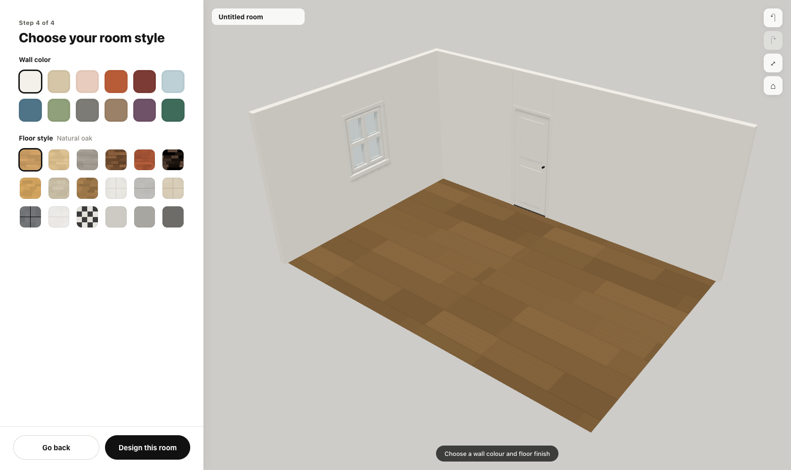
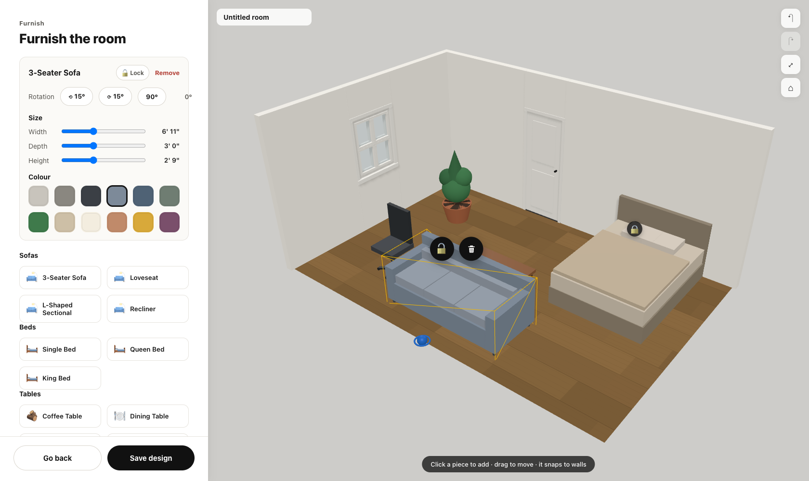

# Roomio — Interior Room Designer

An IKEA‑style, web‑based interior room designer. Author a room through a clean 4‑step
wizard — pick a shape, set the dimensions, add doors & windows, choose your style — then
furnish it with parametric furniture that **won't clip through walls**.

Built with **React + React Three Fiber (Three.js) + TypeScript + Zustand**, a serializable
scene‑graph data model, an **Express + Postgres** auth/session backend, and an optional
local **VLM capture‑suggestor** pipeline.

---

## Screenshots

**Log in (Postgres‑backed sessions, with a guest fallback)**



**Step 1 — pick a room shape (Rectangular / L / T / U / Cut / Beveled), live 3D preview**



**Step 2 — drag or type wall lengths, feet/centimetre toggle, live dimension labels**



**Step 3 — place doors & windows snapped to walls (real holes cut), then resize them**



**Step 4 — wall colour + floor texture material swap**



**Furnish — add archetypes, move / rotate / resize / recolor, lock in place; collision keeps
furniture inside the walls and snaps it flush**



---

## Features

- **4‑step authoring wizard** with a persistent live 3D preview.
- **6 room shapes** as parametric corner polygons (incl. concave L/T/U).
- **Draggable & typed wall dimensions** with a feet ⇄ centimetres toggle and live labels.
- **Doors & windows**: a style palette (single / glass / French / double / bifold / glass‑double
  doors, single / double windows), snapped to walls with real openings cut, draggable, deletable,
  and **resizable** (width / height / sill).
- **Material editor**: 12 wall colours + 18 procedurally‑generated floor textures (wood / tile /
  concrete) — zero external image assets.
- **Furnish**: ~23 parametric furniture archetypes across sofas, beds, tables, chairs, storage and
  decor (+ a placeholder box). Move, rotate, **clamped resize**, recolor, and **lock in place**.
- **Bespoke collision & snapping** (the hard part): a 2D footprint constraint in the floor plane —
  furniture clamps and *slides* along walls instead of stopping dead, snaps flush, and flags soft
  furniture‑vs‑furniture overlaps. No physics engine.
- **Undo / redo** with gesture‑aware history (⌘Z / ⌘⇧Z).
- **Accounts**: email/password login with httpOnly cookie **sessions stored in Postgres**, and
  per‑user saved designs. Works offline as a guest (designs save to `localStorage`).
- **Save & reopen** the full scene graph — including the **exact camera viewpoint**.
- Optional **capture‑suggestor**: a local vision‑model pipeline that proposes furniture from a room
  photo; suggestion‑only, nothing is auto‑placed.

## Architecture

Three layers with the **scene graph** as the contract between them:

| Layer | Role |
| --- | --- |
| Room builder (wizard) | Deterministic authoring of structure: shape, dimensions, openings, materials. |
| Furnish & edit | Place / move / rotate / resize / recolor furniture with collision + snapping. |
| Capture suggestor (optional) | A scan/photo that *pre‑fills* the wizard — pure convenience, fully skippable. |

Everything the user edits is a cheap data operation on addressable nodes
(`walls / floor / openings / furniture`), so the design serializes straight to JSON for save/load.

## Getting started

```bash
# Front-end (Vite dev server on http://localhost:5180)
npm install
npm run dev

# Auth / designs backend (Express + Postgres on :5181; needs a local `roomio` Postgres db)
cd server
npm install
npm start
```

The front‑end proxies `/api` → `:5181`. With the backend down, the app still runs fully as a guest.

## Testing

```bash
npm test               # 87 vitest unit tests (collision, geometry, units, persistence)
npm run check:browser  # puppeteer: console-error sweep + drag-with-collision + undo/redo
npm run check:auth     # puppeteer: signup → save → logout → login → reopen from Postgres
npm run check:lock     # puppeteer: lock buttons toggle; locked item can't be dragged
```

## Tech stack

React 18 · React Three Fiber / Three.js · TypeScript · Zustand · Vite · Express · node‑postgres ·
vitest · puppeteer‑core.
